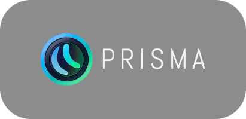

# Prisma Desktop

Приложение Prisma для **Windows, macOS и Linux**. Открывайте рабочее зеркало
Prisma, смотрите видео во встроенном или внешнем плеере и управляйте TorrServer
прямо из настроек приложения.

**[Скачать приложение](https://github.com/Sheinices/prisma-desk/releases/latest)** ·
**[Сообщить о проблеме](https://github.com/Sheinices/prisma-desk/issues)** ·
**[Сборка из исходников](docs/DEVELOPMENT.md)**

## Содержание

- [Возможности](#возможности)
- [Установка](#установка)
- [Первый запуск и выбор зеркала](#первый-запуск-и-выбор-зеркала)
- [Просмотр через TorrServer](#просмотр-через-torrserver)
- [Встроенный плеер](#встроенный-плеер)
- [Внешний плеер](#внешний-плеер)
- [Настройки и обновления](#настройки-и-обновления)
- [Решение проблем](#решение-проблем)
- [Обратная связь](#обратная-связь)
- [Для разработчиков](#для-разработчиков)
- [Лицензия](#лицензия)

## Возможности

- Выбор зеркала Prisma и сохранение ранее работавших адресов.
- Встроенный TorrServer: установка, запуск, остановка и обновление.
- Звук **AC3 / EAC3** во встроенном плеере через FFmpeg.
- Воспроизведение **MKV с H.264**, включая файлы из TorrServer, с перепаковкой при необходимости.
- Выбор аудиодорожек и встроенных текстовых субтитров MKV.
- Пауза, перемотка, громкость и изменение скорости с сохранением высоты звука.
- Запуск VLC, PotPlayer и других внешних плееров.
- Экспорт и импорт настроек в файл.
- Автообновление приложения; Windows portable обновляется вручную.

Приложение загружает веб-интерфейс выбранного зеркала. Доступность каталога
и источников видео зависит от этого зеркала и подключённых сервисов.

## Установка

Откройте [страницу последнего релиза](https://github.com/Sheinices/prisma-desk/releases/latest)
и выберите файл для своей системы и архитектуры.

| Система | Архитектура | Формат |
| --- | --- | --- |
| Windows | x64 | Установщик `.exe` / `.msi` или portable-архив `.zip` |
| macOS с Apple Silicon (M1, M2, M3, M4 и новее) | ARM64 / aarch64 | `.dmg` или архив приложения `.app` |
| macOS с Intel | x64 / x86_64 | `.dmg` или архив приложения `.app` |
| Linux | x64 / x86_64 | `.AppImage`, `.deb` или `.rpm` |

Набор файлов может отличаться между релизами. Файлы `latest.json` и `.sig`
используются для автообновления; открывать их для установки не нужно.

### Windows

**С установкой:** запустите `.exe` или `.msi` и следуйте инструкциям установщика.
Для интерфейса нужен Microsoft Edge WebView2. Если установщик предлагает
установить его, завершите этот шаг.

**Без установки:** распакуйте `Prisma-portable-x64.zip` в отдельную папку
и запустите `Prisma.exe`. Сохраняйте все файлы архива рядом с приложением:
там находятся инструменты для воспроизведения звука и субтитров.

### macOS

Выберите сборку для своего процессора. Его тип указан в меню Apple → «Об этом Mac».

Откройте `.dmg` и перенесите Prisma в папку «Программы». Если скачали архив,
распакуйте его и перенесите `Prisma.app` туда же. Запустите приложение из этой папки.

Если macOS блокирует запуск, проверьте сообщение в
«Системные настройки → Конфиденциальность и безопасность».
Возможность открыть приложение зависит от подписи сборки и настроек системы.

### Linux

Нужны **glibc 2.35 или новее** и **WebKitGTK 4.1**. Например, этим требованиям
соответствуют Ubuntu 22.04+ и Debian 12+. AppImage тоже требует совместимой системы.

Пакет `.deb` или `.rpm` установите средствами своего дистрибутива.
Для AppImage разрешите выполнение файла в его свойствах или через терминал:

```sh
chmod +x ./Prisma.AppImage
./Prisma.AppImage
```

Замените `Prisma.AppImage` на имя скачанного файла.
Если приложение не запускается, см. [решения для Linux](#проблемы-на-linux).

## Первый запуск и выбор зеркала

1. Откройте Prisma Desktop.
2. На стартовом экране укажите адрес рабочего зеркала, начиная с `http://` или `https://`.
3. Подтвердите переход и дождитесь загрузки интерфейса.

По умолчанию предлагается `http://prisma.ws`. Если он недоступен, укажите другое
рабочее зеркало. Приложение сохраняет выбранный адрес и историю рабочих зеркал.

При следующих запусках оно проверяет сохранённый адрес и ранее работавшие зеркала.
Если открыть их не удалось, снова появляется экран выбора.

### Как сменить зеркало

Откройте **Настройки → Настройки Десктоп → Адрес Prisma**, введите новый адрес
и дождитесь перехода.

На macOS также есть пункт меню **«Сменить зеркало…»** и сочетание **⌘⇧M**.
Если интерфейс не загружается, выберите другой адрес на стартовом экране.

## Просмотр через TorrServer

TorrServer позволяет воспроизводить видео из торрентов. Приложение умеет
устанавливать и запускать его на вашем компьютере.

1. Откройте **Настройки → Настройки Десктоп → Настройки встроенного TS**.
2. Нажмите **«Запуск»**. При первом запуске приложение скачает TorrServer.
3. Дождитесь статуса запущенного сервера.
4. Вернитесь к выбору видео в Prisma и откройте нужную раздачу.

По умолчанию сервер работает по адресу `http://localhost:8090`.
После запуска встроенного TorrServer приложение подставляет его адрес в настройки Prisma.

В разделе управления сервером можно включить **«Автозапуск TorrServer при старте»**,
остановить или перезапустить сервер, проверить обновления и открыть веб-интерфейс.
После изменения порта перезапустите сервер.

Удаление доступно в двух вариантах: с сохранением данных или полное.

Если используете TorrServer на другом компьютере или устройстве, задайте его
адрес в настройках TorrServer самого интерфейса Prisma. Запускать встроенный
сервер для такого подключения не требуется.

## Встроенный плеер

FFmpeg и FFprobe входят в комплект приложения. Устанавливать их отдельно
для просмотра не нужно.

### Звук и аудиодорожки

Для прямых HTTP(S)-источников, включая файлы из TorrServer, поддерживаются
**AC3 (Dolby Digital)** и **EAC3 (Dolby Digital Plus)**.
Дорожка выбирается в меню аудиодорожек плеера.

Работают пауза, перемотка, громкость, отключение звука и изменение скорости.
При изменении скорости высота голоса сохраняется. Фильм обрабатывается
по мере воспроизведения; скачивать его целиком заранее не требуется.

Многоканальный звук, включая **5.1 и 7.1**, декодируется программно.
Фактический вывод зависит от устройства и системы; для стереовыхода звук
сводится в стерео. **HDMI passthrough и Atmos не поддерживаются.**

### MKV и видеокодеки

Если система не умеет открывать MKV напрямую, приложение перепаковывает
**видео H.264** в поддерживаемый контейнер без перекодирования изображения.

Это не означает поддержку любого видеокодека: **HEVC / H.265 и другие кодеки
зависят от системного WebView** — движка встроенного плеера.
Если файл не воспроизводится, попробуйте [внешний плеер](#внешний-плеер).

### Субтитры

Встроенные текстовые дорожки MKV появляются в штатном меню субтитров.
Откройте его и выберите нужный язык или дорожку. Там же субтитры можно отключить.

Поддерживаются **SRT, ASS/SSA и WebVTT**. Работают кириллица и перемотка;
текст выводится через слой субтитров Prisma с его настройками отображения.
Сложное оформление ASS и графические субтитры **PGS / VobSub** не поддерживаются.

### Ограничения

- Для перемотки источник должен поддерживать HTTP Range — загрузку нужного участка файла.
- Приложение делает отдельные запросы к источнику для видео, звука и выбранных субтитров.
- **HLS, DASH, DRM и IPTV** используют обычный механизм плеера; описанная обработка FFmpeg к ним не применяется.
- Наличие кодека в FFmpeg не гарантирует, что встроенный плеер сможет декодировать изображение.

## Внешний плеер

Видео можно передавать VLC, PotPlayer или другому установленному плееру.
Сам внешний плеер нужно установить отдельно.

1. Откройте **Настройки → Настройки Десктоп → Внешний плеер**.
2. Выберите плеер или укажите путь к его исполняемому файлу.
3. Выберите внешний плеер для просмотра в настройках плеера Prisma.

На **Windows** есть общий переключатель
**Настройки → Плеер → Тип плеера → Встроенный / Внешний**.
Он меняет выбор для обычного видео и торрентов. Настройки IPTV задаются отдельно.

Для **PotPlayer на Windows** предусмотрено сохранение позиции просмотра
и продолжение воспроизведения. Возможности других внешних плееров могут отличаться.
При возврате во встроенный плеер сохранённый путь к внешнему остаётся в настройках.

## Настройки и обновления

Основные функции приложения находятся в **Настройки → Настройки Десктоп**.

| Что нужно сделать | Пункт настроек |
| --- | --- |
| Сменить зеркало | «Адрес Prisma» |
| Настроить запуск на весь экран | «Запускать в полноэкранном режиме» |
| Включить обновления приложения | «Автообновление» |
| Выбрать внешний плеер | «Внешний плеер» |
| Управлять TorrServer | «Настройки встроенного TS» |
| Сохранить или перенести настройки | «Экспорт/Импорт настроек» |
| Посмотреть версию | «О приложении» |

### Обновления

Включите **«Автообновление»**, чтобы приложение проверяло новые версии при запуске.
Обновления TorrServer проверяются отдельно в разделе управления сервером.

**Windows portable обновляется вручную:** скачайте новый архив со
[страницы релизов](https://github.com/Sheinices/prisma-desk/releases/latest)
и распакуйте его целиком. Этой страницей можно воспользоваться и для ручного
обновления установленной версии.

### Перенос настроек

В разделе **«Экспорт/Импорт настроек»** нажмите **«Экспорт»** и сохраните файл.
На другом компьютере или после переустановки откройте этот же раздел,
нажмите **«Импорт»** и выберите сохранённый файл.

Перед импортом можно экспортировать текущие настройки, чтобы вернуться к ним
при необходимости. Импорт не переносит установленные внешние плееры.

## Решение проблем

### Не открывается интерфейс Prisma

Проверьте интернет-соединение и попробуйте открыть адрес зеркала в браузере.
Если оно недоступно, [смените зеркало](#как-сменить-зеркало).

### TorrServer не запускается

Проверьте статус и сообщение об ошибке в **«Настройки встроенного TS»**.
Если порт `8090` занят другим приложением, выберите свободный порт
и перезапустите сервер. Если TorrServer уже запущен отдельно, проверьте его адрес.

### Видео долго загружается или появляется таймаут

Убедитесь, что TorrServer запущен и его веб-интерфейс открывается.
Попробуйте другую раздачу: скорость зависит от доступности участников раздачи
и соединения. Ответ сервера на запрос не всегда означает, что он уже успел
загрузить данные видео.

### Есть звук, но нет изображения

Проверьте видеокодек файла. Перепаковка MKV поддерживает H.264;
для неподдерживаемого системой кодека выберите внешний плеер.

### Нет звука AC3 / EAC3

Проверьте громкость, отключение звука и выбранную аудиодорожку.
Для portable-версии убедитесь, что архив распакован полностью,
а `prisma-ffmpeg.exe` и `prisma-ffprobe.exe` находятся рядом с `Prisma.exe`.
Для HLS/DASH описанная обработка AC3/EAC3 через FFmpeg не применяется.

### Не отображаются субтитры

Выберите дорожку в меню субтитров. Убедитесь, что файл содержит встроенные
текстовые субтитры: PGS и VobSub не поддерживаются.
Появление дорожек и текста может занять время, пока источник отдаёт данные.

### Не запускается внешний плеер

Проверьте, установлен ли он, и повторно выберите его исполняемый файл
в настройках. Если файл был перемещён или удалён, сохранённый путь нужно обновить.

### Проблемы на Linux

В командах ниже замените `Prisma.AppImage` на имя своего файла.

**Ошибка FUSE или `libfuse.so.2`:** установите поддержку FUSE 2 средствами
своего дистрибутива либо запустите AppImage без FUSE:

```sh
./Prisma.AppImage --appimage-extract-and-run
```

**Белое окно или сбой на NVIDIA:** приложение автоматически учитывает
проприетарный драйвер. Если проблема сохраняется, попробуйте:

```sh
WEBKIT_DISABLE_COMPOSITING_MODE=1 ./Prisma.AppImage
```

**Чёрное окно или проблемы с полноэкранным режимом на Wayland:**

```sh
GDK_BACKEND=x11 ./Prisma.AppImage
```

Для этого варианта в системе должен быть доступен X11/XWayland.

**Не воспроизводится видео в DEB/RPM:** проверьте установку плагинов GStreamer
`good`, `bad` и `libav`. Имена пакетов зависят от дистрибутива.
AppImage включает мультимедийные компоненты, но тоже требует совместимых
glibc и WebKitGTK.

## Обратная связь

Если проблему не удалось решить, создайте
[issue](https://github.com/Sheinices/prisma-desk/issues) и укажите:

- версию Prisma Desktop из раздела «О приложении»;
- операционную систему и архитектуру процессора;
- способ установки: установщик, portable или AppImage;
- шаги, после которых возникает проблема;
- сообщение об ошибке или соответствующий фрагмент лога;
- для проблем воспроизведения — контейнер, видеокодек, аудиокодек и тип субтитров, если они известны.

Перед публикацией удалите из логов пароли, токены и личные ссылки.

## Для разработчиков

Приложение построено на **Tauri 2, Rust и JavaScript**, без Electron.
Инструкции по запуску, сборке, проверкам и выпуску релизов находятся
в [руководстве разработчика](docs/DEVELOPMENT.md).

## Лицензия

Исходный код Prisma Desktop распространяется под
[GNU Affero General Public License v3.0](LICENSE) (**AGPL-3.0-only**).
Лицензии FFmpeg и сведения о его исходниках поставляются вместе с приложением
в папке `media-tools`.
